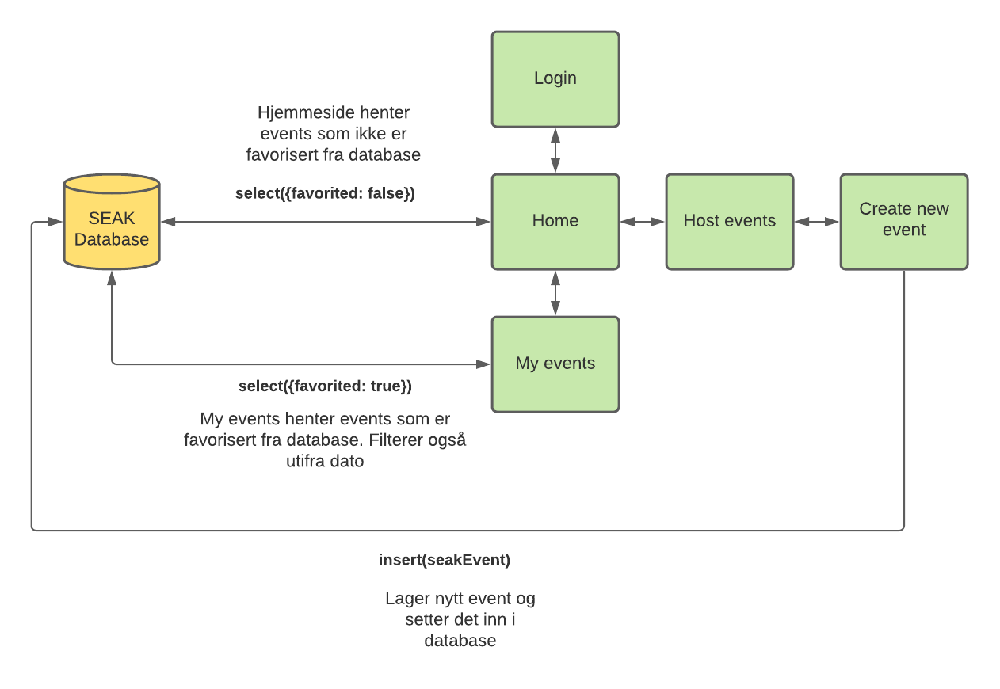
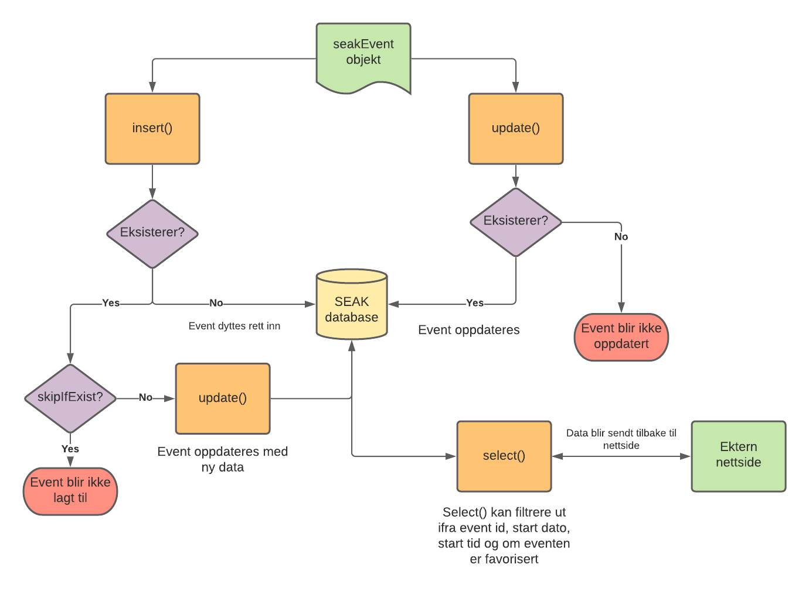

# SEAK Prototype - Gruppe 7A

IS-114/104 Fellesprosjekt

- [SEAK Prototype - Gruppe 7A](#seak-prototype---gruppe-7a)
  - [1. Introduksjon](#1-introduksjon)
    - [1.1  Teknologier utnyttet](#11--teknologier-utnyttet)
    - [1.2 Læremål utfylt](#12-læremål-utfylt)
  - [2. Utvikling av SEAK applikasjonen](#2-utvikling-av-seak-applikasjonen)
    - [2.1 Oversikt over funksjoner](#21-oversikt-over-funksjoner)
    - [2.2 Applikasjonsflyt](#22-applikasjonsflyt)
    - [2.3 Databaseimplementasjon](#23-databaseimplementasjon)
    - [2.4 Kodekonvensjoner](#24-kodekonvensjoner)
    - [2.5 Redusering av duplikat kode](#25-redusering-av-duplikat-kode)
  - [Referanser](#referanser)
  
## 1. Introduksjon 

Vi i gruppe 7A har utviklet applikasjonen vi har designet i 104. Applikasjonen består av en rekke med sider som er utviklet ved help av teknologier som **Javascript**, **Cascading Style Sheets (CSS)** og **Hyper Text Markup Language (HTML)**. Applikasjonen lar brukere se, bli med på og opprette events gjennom et interaktivt brukergrensesnitt. 

### 1.1  Teknologier utnyttet

- **HTML**
  - HTML blir brukt for å bygge selve strukturen til nettsiden og beskriver hvordan elementer skal plasserers. (MDN, 2021a) 
- **CSS**
  - CSS er et stylesheet-språk som lar oss selektivt kustomisere utseende til HTML elementer gjennom bruk av klasser og element-id'er. (MDN, 2021b)
- **Javscript**
  - Javascript er et programmeringspråk som skaper interaktivitet på en nettsiden. Gjennom språket kan du definere oppførselen til nettsiden når du f.eks trykker på en knapp (MDN, 2021c)
- **Git**
  - Git er et versjoneringssystem som holder styr på filer til et prosjekt og lar flere utviklere jobbe på samme prosjekt uten kodekonflikter (Sridhar, 2018)
- **GitHub**
  - GitHub er en tjeneste som bygger oppå Git som gir deg et versjonssystem i skyen. GitHub gir muligheten til å sentralisere prosjekter slik at personer over hele verden kan se, bruke og bidra til kode. (Digital, 2021)
### 1.2 Læremål utfylt
Dette er en liste over læremål vi har utfylt med denne oppgaven


**Læremål for programmering:**
- **Implementere former i et nettleservindu**
  - Denne er utfylt gjennom bruk av CSS der vi har laget bokser og lignende former for å vise data i applikasjonen
- **Implementere interaktivitet i et nettleservindu**
  - Denne er utfylt gjennom bruk av Javascript og Anchor HTML tags for gi mulighet for navigering og interaktivitet med events vist på nettsiden
- **Implementere layout i et nettleservindu**
  - Denne er utfylt gjennom bruk av HTML for å vise fram elementer på nettsiden.
- **Implementere tekst/dokumenter og bilder i nettleservinduet**
  - Denne har vi utfylt gjennom bruk av HTML bilde, headings og paragraf-tags på nettsiden

**Læremål for utviklingsmiljø som er relevante:**

- **Kunne bruke grunnleggende kommandoer for versjonsadministrasjonssystemet i en kommandofortolker**
  - Denne har vi utfylt gjennom bruk av Git bash for å kjøre git commits, pulls, pushes, branchoppretting og merges.  
- **Kunne grunnleggende bruk av et versjonsadministrasjonssystem**
  - Denne har vi utfylt gjennom bruk av GitHub som et samlet repository for alle våre prosjekter.
- **Anvende grunnleggende tekstredigering, filadministrasjon og integrasjon mot VCS (Version Control System) i IntelliJ**
  - Denne har vi utfylt gjennom bruk av Git og GitHub, samt bruk av IntelliJ og Visual Studio Code som også har innebygget VCS integrasjon.
- **Dokumentere systemspesifikasjon**
  - Denne har vi utfylt gjennom bruk av diagrammer som forklarer essensielle funksjoner til applikasjonen, og hvordan dataflyten til nettsiden fungerer

**Læremål for Webapplikasjoner**
- **Utvikle en prototyp for en gitt case**
  - Denne har vi utfylt gjennom utviklingen av 114/104 fellesprosjekt, samt How We Roll. 

## 2. Utvikling av SEAK applikasjonen
 Denne delen tar for seg den tekniske aspektet av utviklingen.
### 2.1 Oversikt over funksjoner

- [x] Navigasjonsbar som viser til alle sider på nettsiden
- [x] Innebygget database for lagring av events og deres statuser
- [x] Dynamisk lasting av events på nettsider ved å hente data ut fra database
- [x] Oppretting av events gjennom HTML form
- [x] Favorisering av events  
- [ ] Klikkbare events med mer detaljert beskrivelse  **ikke implementert**

### 2.2 Applikasjonsflyt

Nettsidens flyt starter ved loginsiden. Når du åpner nettsidens index.html fil vil du automatisk bli omdirigert til login.html gjennom bruk av HTMl meta tags (https://developer.mozilla.org/en-US/docs/Web/HTML/Element/meta). Nettsiden har ingen fungerende innlogging så ved å trykke på “Log in” blir du sendt til hovedssiden. Når hjemmesiden laster, blir det kjørt Javascriptkode for å hente ut events fra SEAK sin innebyggde database. Hjemmesiden henter ut alle events som ikke har blitt favorisert, og dette gjør den gjennom ``select()`` funksjonen som databasen tilbyr.  

Videre har vi “My events” som lister alle events som en bruker har favorisert. Her igjen henter den data utifra SEAK databasen, og filtrerer ut alle events som er merket favorisert. I tillegg filtrerer den ut ifra datoer og plasserer de i riktig inndeling basert på om eventdatoen har vært, om den er idag eller i fremtiden. 

Siste side er “Create new events” der brukere kan opprette nye events. Her kan du fylle inn informasjon om et event, og opprette det. Events som blir opprettet blir satt inn i SEAK databasen gjennom `insert()` som databasen tilbyr. Events som brukeren lager vil automatisk bli vist på hjemmesiden etter den har blitt opprettet. 

### 2.3 Databaseimplementasjon

For at applikasjonen vi utvikler skal være så tilnærmet SEAK appen som mulig, har vi valgt å bygge en enkel database som lagrer events. Dette blir gjort ved å utnytte Javascript’s innebygget sessionStorage som lar deg lagre data i nettleseren hos klienten. Vi valgte sessionStorage ovenfor [localStorage](https://developer.mozilla.org/en-US/docs/Web/API/Window/sessionStorage) siden i sessionStorage blir dataen slettet når du krysser ut siden. Dette er for å unngå unødvendig bruk av plass under demo. Vi valgte å bruke denne metoden etter å ha lært om det i forelesninger vi har hatt i løpet av året. Koden til databasen er forklart inne i [database.js](https://github.com/Gruppe-7A/seak-prototype/blob/main/database.js) filen


Databasen tilbyr tre funksjoner som resten av applikasjonen bruker for å skape, oppdatere og lese data:
- `database.insert()` -  Setter inn nye eventer i databasen, eller oppdaterer de om de eksisterer om ønskelig. Hvis du ikke vil at den skal oppdatere et event som allerede eksisterer, blir eventet ignorert.
- `database.update()` - Oppdaterer eksisterende events med ny data
- `database.select()` - Henter ut events i  et objektformat slik at dataen kan bli lest andre steder i applikasjonen og vist. Den lar deg filtrere slik at du får akkurat den dataen du trenger ut fra databasen.

Et `seakEvent` er Javascriptobjekter som er strukturert slik:
``` javascript
 {
      name: "event_name",
      description: "event_long_description",
      shortDescription: "event_short_description",
      accessType: "public/private",
      startDate: "YYYY-mm-DD",
      startTime: "start_time",
      location: "event_location",
      imageUrl: "image_url",
      favorited: true,
      id: 1,
    }
```
Hvert event vil ha en egen unik ID som resten av applikasjon bruker til å hente ut enkelte eventer og prosessere de. 

Databasen er kjernekomponenten til applikasjonen vi har utviklet. Det er denne som gjør at appen er betydelig mer dynamisk siden den lagrer alle endringer du gjør. Om vi skulle kun lagret nye events i Javascript-objekter lokalt på en HTML side, ville de blitt fjernet hver gang du laster siden på nytt siden Javascript variabler blir ikke beholdt under refresh. Gjennom databasen beholder vi alle endringer gjennom hele sesjonen til klienten. 

### 2.4 Kodekonvensjoner

Under utvikling har vi lagt stort fokus på god kodekonvensjon. Dette var et krav vi satt når vi startet å utvikle, og vi ga et gruppemedlem hovedansvar for å passe på at kodekonvensjonen ble fulgt riktig. Til å starte med startet vi dårlig med dårlig CSS-konvensjon, men dette ble rettet opp under utvikling.

Vi har hovedsakelig fulgt kodekonvensjonene som W3schools definerer til HTML og Javascript, men bruker Google sin HTML/CSS styling guidelines for CSS kodekonvensjoner. 

**Javascript kodekonvensjoner**

Her har vi fulgt denne kodekonvensjonen: https://www.w3schools.com/js/js_conventions.asp\

Hovedfokuset her har vært 
- camelCasing for variabelnavn og funksjonsnavn
- forklarende variabelnavn og funksjonsnavn
- bruk av `const` når en variabel ikke skal få en ny verdi
- bruk av `let` når en variabel kan få en ny verdi
- unngå bruk av `var` for å ikke rote til global variabelscope
- riktig bruk av kodeinnrykk og mellomrom mellom operators (+, -, /)
- filnavn i små bokstaver

Her er et eksempel på god kodekonvensjon:
``` javascript
const examResult = getExamResult() //bruker const siden verdi ikke endres
if (examResult.grade === 'A') {
    console.log(":)")
} else {
    console.log(":(")
}
```
Denne koden kan også forkortes ved bruk av *Conditional Operator*, også skalt *Ternany Operator*, spesifisert i [ECMA-262](https://www.ecma-international.org/wp-content/uploads/ECMA-262_11th_edition_june_2020.pdf) (Kap 12.14). Man kan argumentere om denne måten er mer leselig. Man burde gjøre koden så enkel og forståelig som mulig slik at andre lettere kan hjelpe til med utvikling
```javascript

getExamResult().grade === 'A' ? console.log(':)') : console.log(':(')
```

**HTML kodekonvensjoner**

Her har vi fulgt disse kodekonvensjonene: https://www.w3schools.com/html/html5_syntax.asp

Hovedfokuset har vært:
- alle HTML filer starter med `<!DOCTYPE html>`
- alle HTML elementer skal stenges. Elementer som `<input>` trenger egentlig ikke å stenges, men det er god konvensjon å stenge de uansett.
- alle `` elementer blir gitt høyde og bredde gjennom CSS styling
- riktig innrykk av elementer

Her er et eksempel på god kodekonvensjon (uten styling):
```html
<!DOCTYPE html>
<!-- Spesifiserer språket til siden, behjelpelig for søkemotorer-->
<html lang="en-US"> 
<html>
    <head>
        <!-- Sikrer riktig format for søkemotorer -->
        <meta charset="UTF-8"> 
        <!-- Forteller nettleser hvordan den skal skalere innhold på nettsiden. Nyttig for forskjellige skjermstørrelser -->
        <meta name="viewport" content="width=device-width, initial-scale=1.0">
        <title> Exam Result </title>
    </head>
    <body>
        <form>
            <label for="grade-input">Grade:</label>
            <select id="grade-input" name="grade">
                <option value="a">A</option>
            </select>
            <input type="submit" value="Submit grade"/>
        </form>
    </body>
</html>
```

Bruk av `<html>`, `<body>` og `<head>` er ikke nødvendig ifølge HTML spesifikasjonen (https://html.spec.whatwg.org/#syntax-tag-omission). I Google sin spesifikasjon sier de også at valgfrie HTML elementer kan fjernes for filoptimalisering, men anbefaler å vente til dette har blitt mer standard (Google, 2021)

**CSS kodekonvensjoner**

Her har vi fulgt disse kodekonvensjonene: https://google.github.io/styleguide/htmlcssguide.html

Hovedfokuset har vært:
- forklarende id og klassenavn som ikke er for korte, men ikke for lange heller
- bruke bindestreker som skilletegn for klasser/id'er med flere ord
- alltid bruk semicolon når en deklarasjon stopper
- riktig blokkinnrykk

Her er et eksempel på god kodekonvensjon

```css
h1,
h2,
h3 {
    color: red;
    font-weight: normal;
    line-height: 1.2;
}

.grade-input {
    color: #53ed56;
    font-size: 1.5em;
}

.grade-input option {
    background-color: yellow;
}
```

### 2.5 Redusering av duplikat kode

I tillegg til god kodekonvensjon, har vi vært opptatt av å redusere mengden duplikat kode hvor mulig uten å skape unødvendig kompleksitet til programmet. Dette har vi gjort ved et utbredt bruk av generiske Javascript funksjoner og generiske CSS klasser. I prinsippet vil du lage kode som kan brukes flere steder. Om en blokk med kode trengs flere steder i en applikasjon, er det da gunstig å gjøre det om til en funksjon. 

I Javascript benyttet vi bruk av moduler ([ECMA-262 spec](https://262.ecma-international.org/12.0/#sec-modules)) for å lage gjenbrukare funksjoner som andre Javascript filer og `<script>` tags i HTML kan importere. En modul kan eksportere funksjoner/objekter eller importere de gjennom `export` og `import` syntax.

I vår kodebase har vi to moduler: [utils.js](https://github.com/Gruppe-7A/seak-prototype/blob/main/utils.js) og [database.js](https://github.com/Gruppe-7A/seak-prototype/blob/main/database.js)

## Referanser

Digital (2021) *An Introduction to GitHub* https://digital.gov/resources/an-introduction-github/
Google (2021, 13.12) *Google HTML/CSS Style Guide*
https://google.github.io/styleguide/htmlcssguide.html#Optional_Tags
MDN (2021a, 13.12) *HTML Basics*
https://developer.mozilla.org/en-US/docs/Learn/Getting_started_with_the_web/HTML_basics\
MDN (2021b, 13.12) *CSS Basics*
https://developer.mozilla.org/en-US/docs/Learn/Getting_started_with_the_web/CSS_basics\
MDN (2021c, 13.12) *JavaScript basics* https://developer.mozilla.org/en-US/docs/Learn/Getting_started_with_the_web/JavaScript_basics\
Sridhar, A (2018) *An introduction to Git: what it is, and how to use it*. https://www.freecodecamp.org/news/what-is-git-and-how-to-use-it-c341b049ae61/\
