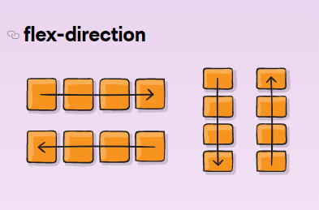
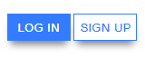
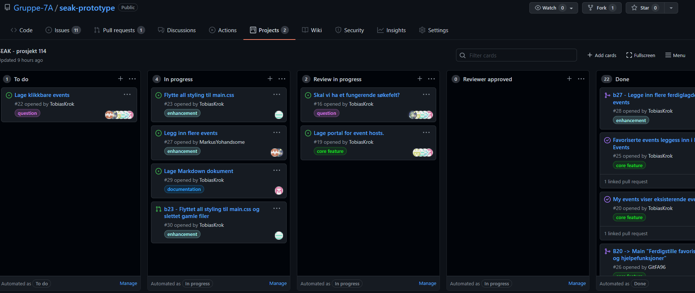
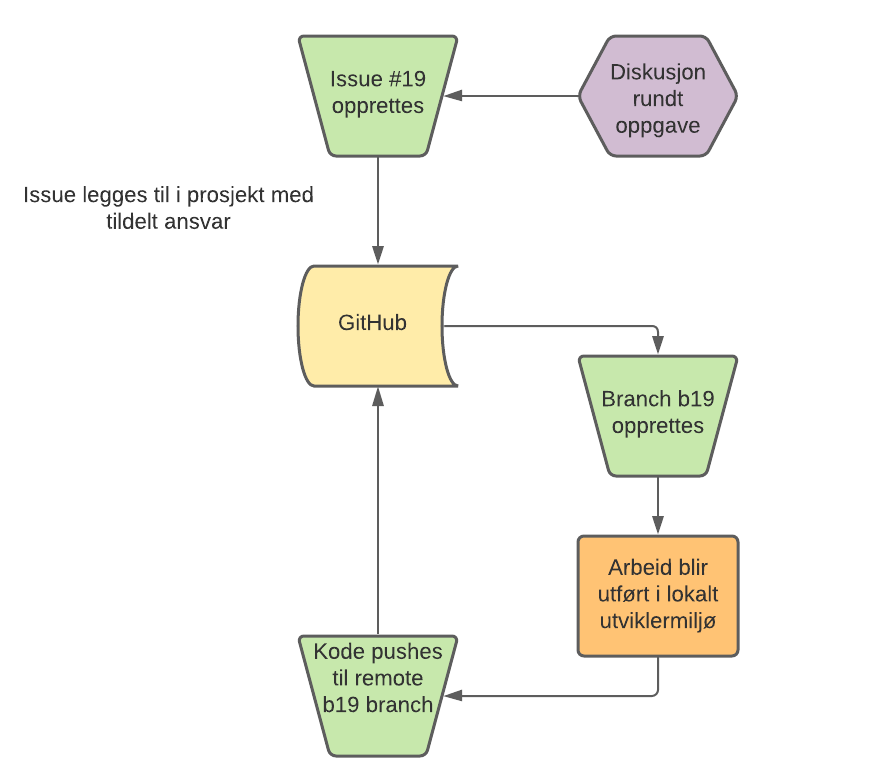
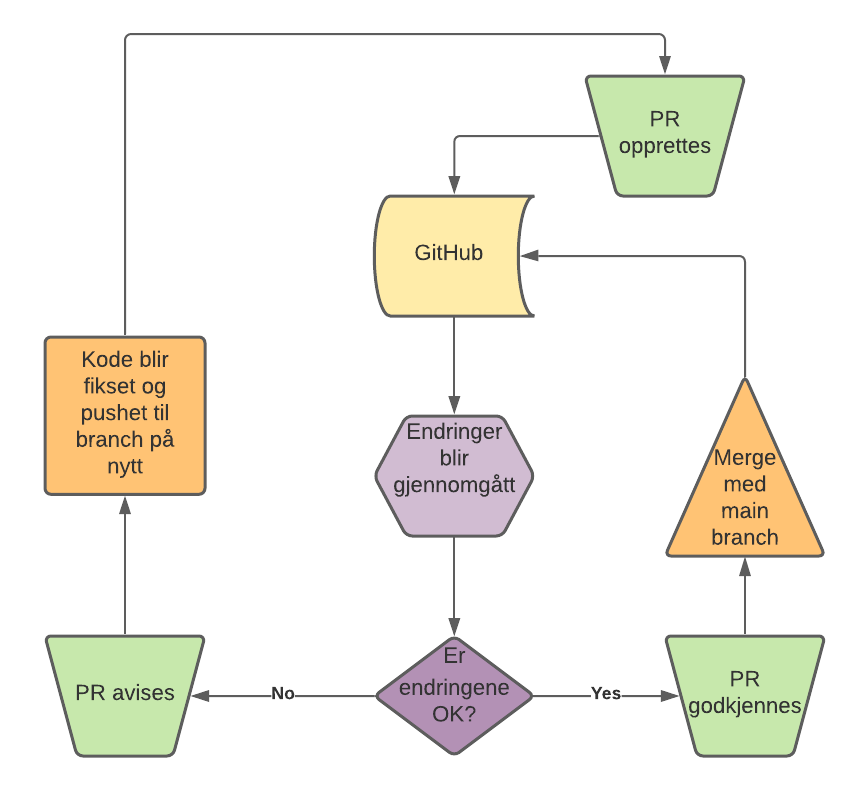
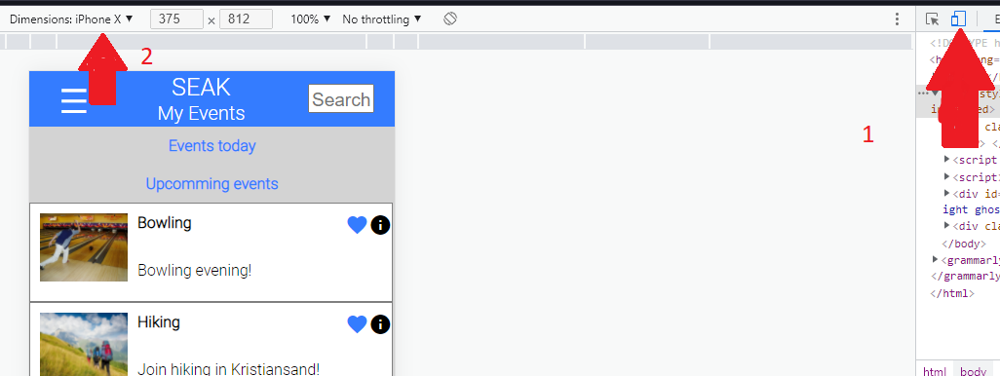

# SEAK Prototype - Gruppe 7A


IS-114/104 Fellesprosjekt 

**Github Pages link:** https://gruppe-7a.github.io/

<u>**Vil du teste applikasjonen? Les dette først:**</u> [Hvordan teste applikasjonen](#hvordan-teste-applikasjonen)

- [SEAK Prototype - Gruppe 7A](#seak-prototype---gruppe-7a)
  - [1. Introduksjon](#1-introduksjon)
    - [1.1  Teknologier utnyttet](#11--teknologier-utnyttet)
    - [1.2 Læremål utfylt](#12-læremål-utfylt)
  - [2. Utvikling av SEAK applikasjonen](#2-utvikling-av-seak-applikasjonen)
    - [2.1 Oversikt over funksjoner](#21-oversikt-over-funksjoner)
    - [2.2 Applikasjonsflyt](#22-applikasjonsflyt)
    - [2.3 Databaseimplementasjon](#23-databaseimplementasjon)
    - [2.4 Kodekonvensjoner](#24-kodekonvensjoner)
    - [2.5 Redusering av duplikat kode](#25-redusering-av-duplikat-kode)
    - [2.6 Feilsøking](#26-feilsøking)
  - [3 Bruk av Git og Github](#3-bruk-av-git-og-github)
    - [3.1 Hovedfokus og regler](#31-hovedfokus-og-regler)
    - [3.2 Oppretting av issues og branches](#32-oppretting-av-issues-og-branches)
    - [3.3 Pull Requests og godkjennelse](#33-pull-requests-og-godkjennelse)
  - [Hvordan teste applikasjonen](#hvordan-teste-applikasjonen)
    - [Hvordan sette riktig skjermstørrelse](#hvordan-sette-riktig-skjermstørrelse)
    - [Hva du kan teste ut](#hva-du-kan-teste-ut)
  - [Referanser](#referanser)
  
## 1. Introduksjon 

Vi i gruppe 7A har utviklet applikasjonen vi har designet i 104. Applikasjonen består av en rekke med sider som er utviklet ved help av teknologier som **Javascript**, **Cascading Style Sheets (CSS)** og **Hyper Text Markup Language (HTML)**. Applikasjonen lar brukere se, bli med på og opprette events gjennom et interaktivt brukergrensesnitt. 

### 1.1  Teknologier utnyttet

- **HTML**
  - HTML blir brukt for å bygge selve strukturen til nettsiden og beskriver hvordan elementer skal plasserers. (MDN, 2021a) 
  - Spesifikasjon: https://html.spec.whatwg.org/
- **CSS**
  - CSS er et stylesheet-språk som lar oss selektivt kustomisere utseende til HTML elementer gjennom bruk av klasser og element-id'er. (MDN, 2021b)
  - Spesifikasjon: https://www.w3.org/Style/CSS/specs.en.html
- **Javscript**
  - Javascript er et programmeringspråk som skaper interaktivitet på en nettsiden. Gjennom språket kan du definere oppførselen til nettsiden når du f.eks trykker på en knapp (MDN, 2021c)
  - Spesifikasjon: https://262.ecma-international.org/12.0/
- **Git**
  - Git er et versjoneringssystem som holder styr på filer til et prosjekt og lar flere utviklere jobbe på samme prosjekt uten kodekonflikter (Sridhar, 2018)
- **GitHub**
  - GitHub er en tjeneste som bygger oppå Git som gir deg et versjonssystem i skyen. GitHub gir muligheten til å sentralisere prosjekter slik at personer over hele verden kan se, bruke og bidra til kode. (Digital, 2021)
### 1.2 Læremål utfylt
Dette er en liste over læremål vi har utfylt med denne oppgaven


**Læremål for programmering:**
- **Implementere former i et nettleservindu**
  - Denne er utfylt gjennom bruk av CSS der vi har laget bokser og lignende former for å vise data i applikasjonen
- **Implementere interaktivitet i et nettleservindu**
  - Denne er utfylt gjennom bruk av Javascript og Anchor HTML tags for gi mulighet for navigering og interaktivitet med events vist på nettsiden
- **Implementere layout i et nettleservindu**
  - Denne er utfylt gjennom bruk av HTML for å vise fram elementer på nettsiden.
- **Implementere tekst/dokumenter og bilder i nettleservinduet**
  - Denne har vi utfylt gjennom bruk av HTML bilde, headings og paragraf-tags på nettsiden

**Læremål for utviklingsmiljø som er relevante:**

- **Kunne bruke grunnleggende kommandoer for versjonsadministrasjonssystemet i en kommandofortolker**
  - Denne har vi utfylt gjennom bruk av Git bash for å kjøre git commits, pulls, pushes, branchoppretting og merges.  
- **Kunne grunnleggende bruk av et versjonsadministrasjonssystem**
  - Denne har vi utfylt gjennom bruk av GitHub som et samlet repository for alle våre prosjekter.
- **Anvende grunnleggende tekstredigering, filadministrasjon og integrasjon mot VCS (Version Control System) i IntelliJ**
  - Denne har vi utfylt gjennom bruk av Git og GitHub, samt bruk av IntelliJ og Visual Studio Code som også har innebygget VCS integrasjon.
- **Dokumentere systemspesifikasjon**
  - Denne har vi utfylt gjennom bruk av diagrammer som forklarer essensielle funksjoner til applikasjonen, og hvordan dataflyten til nettsiden fungerer

**Læremål for Webapplikasjoner**
- **Utvikle en prototyp for en gitt case**
  - Denne har vi utfylt gjennom utviklingen av 114/104 fellesprosjekt, samt How We Roll. 

## 2. Utvikling av SEAK applikasjonen
 Denne delen tar for seg den tekniske aspektet av utviklingen.
### 2.1 Oversikt over funksjoner

- [x] Navigasjonsbar som viser til alle sider på nettsiden
- [x] Innebygget database for lagring av events og deres statuser
- [x] Dynamisk lasting av events på nettsider ved å hente data ut fra database
- [x] Oppretting av events gjennom HTML form
- [x] Favorisering av events  
- [ ] Klikkbare events med mer detaljert beskrivelse  **ikke implementert**

### 2.2 Applikasjonsflyt

Nettsidens flyt starter ved loginsiden. Når du åpner nettsidens index.html fil vil du automatisk bli omdirigert til login.html gjennom bruk av HTMl meta tags (https://developer.mozilla.org/en-US/docs/Web/HTML/Element/meta). Nettsiden har ingen fungerende innlogging så ved å trykke på “Log in” blir du sendt til hovedssiden. Når hjemmesiden laster, blir det kjørt Javascriptkode for å hente ut events fra SEAK sin innebyggde database. Hjemmesiden henter ut alle events som ikke har blitt favorisert, og dette gjør den gjennom ``select()`` funksjonen som databasen tilbyr.  

Videre har vi “My events” som lister alle events som en bruker har favorisert. Her igjen henter den data utifra SEAK databasen, og filtrerer ut alle events som er merket favorisert. I tillegg filtrerer den ut ifra datoer og plasserer de i riktig inndeling basert på om eventdatoen har vært, om den er idag eller i fremtiden. 

Siste side er “Create new events” der brukere kan opprette nye events. Her kan du fylle inn informasjon om et event, og opprette det. Events som blir opprettet blir satt inn i SEAK databasen gjennom `insert()` som databasen tilbyr. Events som brukeren lager vil automatisk bli vist på hjemmesiden etter den har blitt opprettet. 

### 2.3 Databaseimplementasjon

For at applikasjonen vi utvikler skal være så tilnærmet SEAK appen som mulig, har vi valgt å bygge en enkel database som lagrer events. Dette blir gjort ved å utnytte Javascript’s innebygget sessionStorage som lar deg lagre data i nettleseren hos klienten. Vi valgte sessionStorage ovenfor [localStorage](https://developer.mozilla.org/en-US/docs/Web/API/Window/sessionStorage) siden i sessionStorage blir dataen slettet når du krysser ut siden. Dette er for å unngå unødvendig bruk av plass under demo. Vi valgte å bruke denne metoden etter å ha lært om det i forelesninger vi har hatt i løpet av året. Koden til databasen er forklart inne i [database.js](https://github.com/Gruppe-7A/seak-prototype/blob/main/database.js) filen


Databasen tilbyr tre funksjoner som resten av applikasjonen bruker for å skape, oppdatere og lese data:
- `database.insert()` -  Setter inn nye eventer i databasen, eller oppdaterer de om de eksisterer om ønskelig. Hvis du ikke vil at den skal oppdatere et event som allerede eksisterer, blir eventet ignorert.
- `database.update()` - Oppdaterer eksisterende events med ny data
- `database.select()` - Henter ut events i  et objektformat slik at dataen kan bli lest andre steder i applikasjonen og vist. Den lar deg filtrere slik at du får akkurat den dataen du trenger ut fra databasen.

Et `seakEvent` er Javascriptobjekter som er strukturert slik:
``` javascript
 {
      name: "event_name",
      description: "event_long_description",
      shortDescription: "event_short_description",
      accessType: "public/private",
      startDate: "YYYY-mm-DD",
      startTime: "start_time",
      location: "event_location",
      imageUrl: "image_url",
      favorited: true,
      id: 1,
    }
```
Hvert event vil ha en egen unik ID som resten av applikasjon bruker til å hente ut enkelte eventer og prosessere de. 

Databasen er kjernekomponenten til applikasjonen vi har utviklet. Det er denne som gjør at appen er betydelig mer dynamisk siden den lagrer alle endringer du gjør. Om vi skulle kun lagret nye events i Javascript-objekter lokalt på en HTML side, ville de blitt fjernet hver gang du laster siden på nytt siden Javascript variabler blir ikke beholdt under refresh. Gjennom databasen beholder vi alle endringer gjennom hele sesjonen til klienten. 

### 2.4 Kodekonvensjoner

Under utvikling har vi lagt stort fokus på god kodekonvensjon. Dette var et krav vi satt når vi startet å utvikle, og vi ga et gruppemedlem hovedansvar for å passe på at kodekonvensjonen ble fulgt riktig. Til å starte med startet vi dårlig med dårlig CSS-konvensjon, men dette ble rettet opp under utvikling.

Vi har hovedsakelig fulgt kodekonvensjonene som W3schools definerer til HTML og Javascript, men bruker Google sin HTML/CSS styling guidelines for CSS kodekonvensjoner. 

**Javascript kodekonvensjoner**

Her har vi fulgt denne kodekonvensjonen: https://www.w3schools.com/js/js_conventions.asp\

Hovedfokuset her har vært 
- camelCasing for variabelnavn og funksjonsnavn
- forklarende variabelnavn og funksjonsnavn
- bruk av `const` når en variabel ikke skal få en ny verdi
- bruk av `let` når en variabel kan få en ny verdi
- unngå bruk av `var` for å ikke rote til global variabelscope
- riktig bruk av kodeinnrykk og mellomrom mellom operators (+, -, /)
- filnavn i små bokstaver

Her er et eksempel på god kodekonvensjon:
``` javascript
const examResult = getExamResult() //bruker const siden verdi ikke endres
if (examResult.grade === 'A') {
    console.log(":)")
} else {
    console.log(":(")
}
```
Denne koden kan også forkortes ved bruk av *Conditional Operator*, også skalt *Ternany Operator*, spesifisert i [ECMA-262](https://www.ecma-international.org/wp-content/uploads/ECMA-262_11th_edition_june_2020.pdf) (Kap 12.14). Man kan argumentere om denne måten er mer leselig. Man burde gjøre koden så enkel og forståelig som mulig slik at andre lettere kan hjelpe til med utvikling
```javascript
getExamResult().grade === 'A' ? console.log(':)') : console.log(':(')
```

**HTML kodekonvensjoner**

Her har vi fulgt disse kodekonvensjonene: https://www.w3schools.com/html/html5_syntax.asp

Hovedfokuset har vært:
- alle HTML filer starter med `<!DOCTYPE html>`
- alle HTML elementer skal stenges. Elementer som `<input>` trenger egentlig ikke å stenges, men det er god konvensjon å stenge de uansett.
- alle `` elementer blir gitt høyde og bredde gjennom CSS styling
- riktig innrykk av elementer

Her er et eksempel på god kodekonvensjon (uten styling):
```html
<!DOCTYPE html>
<!-- Spesifiserer språket til siden, behjelpelig for søkemotorer-->
<html lang="en-US"> 
<html>
    <head>
        <!-- Sikrer riktig format for søkemotorer -->
        <meta charset="UTF-8"> 
        <!-- Forteller nettleser hvordan den skal skalere innhold på nettsiden. Nyttig for forskjellige skjermstørrelser -->
        <meta name="viewport" content="width=device-width, initial-scale=1.0">
        <title> Exam Result </title>
    </head>
    <body>
        <form>
            <label for="grade-input">Grade:</label>
            <select id="grade-input" name="grade">
                <option value="A">A</option>
            </select>
            <input type="submit" value="Submit grade"/>
        </form>
    </body>
</html>
```

Bruk av `<html>`, `<body>` og `<head>` er ikke nødvendig ifølge HTML spesifikasjonen (https://html.spec.whatwg.org/#syntax-tag-omission). I Google sin CSS/HTML retningslinjen sier de også at valgfrie HTML elementer kan fjernes for filoptimalisering, men anbefaler å vente til dette har blitt mer standard (Google, 2021)

**CSS kodekonvensjoner**

Her har vi fulgt disse kodekonvensjonene: https://google.github.io/styleguide/htmlcssguide.html

Hovedfokuset har vært:
- forklarende id og klassenavn som ikke er for korte, men ikke for lange heller
- bruke bindestreker som skilletegn for klasser/id'er med flere ord
- alltid bruk semicolon når en deklarasjon stopper
- riktig blokkinnrykk

Her er et eksempel på god kodekonvensjon

```css
h1,
h2,
h3 {
    color: red;
    font-weight: normal;
    line-height: 1.2;
}

.grade-input {
    color: #53ed56;
    font-size: 1.5em;
}

.grade-input option {
    background-color: yellow;
}
```

### 2.5 Redusering av duplikat kode

I tillegg til god kodekonvensjon, har vi vært opptatt av å redusere mengden duplikat kode hvor mulig uten å skape unødvendig kompleksitet til programmet. Dette har vi gjort ved et utbredt bruk av generiske Javascript funksjoner og generiske CSS klasser. I prinsippet vil du lage kode som kan brukes flere steder. Om en blokk med kode trengs flere steder i en applikasjon, er det da gunstig å gjøre det om til en funksjon. 

**Reduksjon av duplikat Javascriptkode**

I Javascript benyttet vi bruk av moduler ([ECMA-262 spec](https://262.ecma-international.org/12.0/#sec-modules)) for å lage gjenbrukare funksjoner som andre Javascript filer og `<script>` tags i HTML kan importere. En modul kan eksportere funksjoner/objekter eller importere de gjennom `export` og `import` syntax.

I vår kodebase har vi to moduler: `utils.js` og `database.js`. Utils.js *eksporterer* en rekke med hjelpefunksjoner som blir brukt rundt om kring i programmet. Database.js *eksporterer* funksjoner for å samhandle med databasen.

Et eksempel på hvordan vi har minimert duplikat kode er gjennom Javascript-generering av HTML i `utils.js` (kode er forklart i filen).
```javascript
export function generateEventHtml(events) {
  return ` ${events
    .map(
      (event) => `<div class="row-wrapper event-card">
             
         <div class="wrapper event-text">
             <h4>${event.name}</h4>
             <p>${event.shortDescription}</p>
        </div>
     <div class="row-wrapper event-icons">
         <span class="material-icons"  id=${event.id} style=${event.favorited ? "color:#347CFF;" :"color:#000000;" }>favorite</span>
         <span class="material-icons">info </span>
     </div>
 </div>`
    )
    .join("")}`;
}
```
Dette er en funksjon som generer HTML elementer for visning av eventer i applikasjonen. Siden eventer skal vises på lik måte men på forskjellige sider, gir det mening å gjøre dette om til en funksjon slik at alle sider som trenger events kan bruke de.

Man kan se bruken av denne funksjonen i `home.html` og `myevents.html` (koden til snippets er forklart i selve filene):

snippet fra `home.html`. Her bruker vi både `select()` og `generateEventHtml()` som blir eksportert fra moduler
```javascript
import { select } from "./database.js";
import { generateEventHtml } from "./utils.js";

const events = select({ favorited: false });
const eventsHtml = generateEventHtml(events)

const html = `<div class="wrapper">
                <div class="row-wrapper section-divider">
                    <h4>Suggested for you</h4>
                </div>
                <div class="wrapper event-section">
                    ${eventsHtml}
                </div>
            </div>`;
```
snippet fra `myevents.html`. Her ser du også at vi bruker `toFormattedDate()` flere ganger
```javascript
import { select } from "./database.js";
import { generateEventHtml, toFormattedDate } from "./utils.js";

const eventsToday = select({ favorited: true, startDate: toFormattedDate(new Date())});
const futureEvents = select({favorited: true, startDate: `> ${toFormattedDate(new Date())}`})
const pastEvents = select({favorited: true, startDate: `< ${toFormattedDate(new Date())}`})

const eventsTodayHtml = generateEventHtml(eventsToday)
const futureEventsHtml = generateEventHtml(futureEvents)
const pastEventsHtml = generateEventHtml(pastEvents)
```

Begge eksemplene bruker `select()` og `generateEventHmtl()`. Begge trenger det samme resultatet, dermed er regelmessig å lage funksjoner slik at disse kan gjennbrukes.

**Redusering av duplikat CSS styling i HTML**

I CSS brukte vi generiske klasser som gir styling flere elementer kan bruke. Om vi så at flere elementer brukte samme styling så lagde vi klasser slik at alle elementene kan bruke den.

I sidenene våre måtte flesteparten av elementer bruke en av disse `flex` ([FlexBox spesifikasjon](https://www.w3.org/Style/CSS/specs.en.html#flexbox)) instillingene:
```css
wrapper {
    display: flex;
    flex-direction: column;
}

row-wrapper {
    display: flex;
    /** flex-direction: row; er ikke nødvendig siden row er default når du bruker flexbox **/
    /** dette er bare for å gjøre det lettere å forstå hva klassen gjør **/
    flex-direction: row;
}
```

`wrapper` er den mest brukte og gjør slik at elementer automatisk plasserer seg kolonnevis. `row-wrapper` brukes når elementer skal plasseres ved siden av hverandre
 
 \
 (Coyier, 2021, figur 3)

I HTML har disse klassene blitt brukt slik (forkortet utdrag av `createvents.html`):
```html
<div class="wrapper">
        <form class="wrapper event-form" id="create-event-form" action="">
             <div class="wrapper event-input-wrapper">
                 <label for="name" >Name of your event</label>
                 <input type="text" id="name" class="form-input large-input" name="name" required/>
             </div>
        </form>
</div>
```
Her ser du at `wrapper` blir brukt flere ganger for å posisjonere kolonnevis. Vi kan gi et HTML element flere klasser ved å ha mellomrom mellom klassenavn i  `class` attributtet. Vi bruker samme klasse flere steder for å unngå å skrive de samme CSS stylingene flere ganger.

Vi har i tillegg strukturert stylings slik at vi har hovedklasser og underklasser. Under vises det et eksempel på styling til `primary` og `secondary` knapper
``` css
/** Hovedstyling for knapper i SEAK **/
.seak-button  {
    color: white;
    background-color: var(--seak-main-color);
    border: none;
    height: 30px;
    width: 80px;
    box-shadow: 0 8px 8px -4px gray;
    font-variant-caps: all-petite-caps;
    font-size: 16px;
}
/** Secondary button styling  **/
.seak-button-secondary {
    background-color: white !important; 
    color: var(--seak-main-color) !important; 
    border: var(--seak-main-color) solid 0.5px !important;
}
```
`seak-button-seconday` overskriver stylingen til `seak-button-secondary` ved bruk av `!important` ([CSS spesifikasjon for !important](https://www.w3.org/TR/css-cascade-4/#importance)). 

På nettsiden styles knapper slik ved bruk av disse klassene:



```html
<button class="seak-button"> LOG IN </button>
<button class="seak-button seak-button-secondary"> SIGN UP </button>
```


Gjennom bruk av Javscriptfunksjoner og CSS klasser har vi klart å betraktelig redusere mengden kode i prosjektet og gjør det mye enklere å vedlikeholde for videre drift.

### 2.6 Feilsøking

Under utvikling har vi møtt flere feil og "bugs" som måtte fikses. Vi på gruppa satt sammen og prøvde å løse problemene vi møtte. For å undersøke potensielle løsninger måtte vi søke opp feilkoder vi fikk og se om det fantes løsninger på nettet. Det ble i stor grad brukt Stack Overflow.

Når vi møtte en feil i programmet, undersøkte vi ved å bruke `console.log()` for å se hvor koden eventuelt feiler. For å lese hva `console.log()` skriver ut, brukte vi Google Chrome's Developer Console. Vi kunne også ha brukt [Visual Studio Code debugger](https://code.visualstudio.com/docs/editor/debugging)

Slik brukte vi `console.log()` for feilsøking av kode som crasher:
``` javascript
const examResult = getExamResult()

console.log(examResult) // output => undefined
// Her crasher koden siden examResult er undefined, dermed finnes ikke 'grade' 
// Vi har da funnet ut at getExamResult() har en feil, og vi kan undersøke videre.
if (examResult.grade === 'A') {
    console.log(":)")
} else {
    console.log(":(")
}
```
Under utviklingen så har vi ikke tenkt så veldig mye på god feilbehandling. Noen i gruppen prøvde i sette seg inn i hvordan best behandle feil men vi fant ut at riktig feilbehandling i alle deler av koden ville ta for mye tid. Om vi skulle gjort alt om igjen, hadde vi fra starten brukt `try/catch` blokker for å fange feil og håndtere med en gang.

## 3 Bruk av Git og Github

Vi har i stor grad prøvd å ha en strukturert arbeidsmåte når det kommer til utviklingen ved hjelp av Git. Av Git og GitHub sine funksjoner har vi brukt følgende:
- Automated Kanban Board
- Issues med labels
- Branches
- Pull Requests (PR)
- Reviews

Et bilde av vårt Kanban bord under utvikling:


### 3.1 Hovedfokus og regler

Kort summert har vi lagt fokus på dette under utvikling

- Alt som skal gjøres på appen må ha issue opprettet i prosjektsiden
- Alle issues skal ha label som er beskrivende til formålet av issuet
- Alle branches skal være tilknyttet en issue
- Alle PR's skal bli godkjent av en annen enn personen som oppretter PR.

Disse regelene har vi forsøkt å fulgt så godt vi kunne gjennom hele prosjektet. Vi ga en person hovedansvar for å passe på at issues var riktig satt opp og at resten av gruppemedlemmene opprettet og brukte riktig branch når de skulle bidra med kode og kommentarer. 

### 3.2 Oppretting av issues og branches


Når vi hadde en oppgave som måtte gjøres, diskuterte vi hva som skal gjøres og hvem som får ansvar for at dette blir gjort. Når dette var bestemt, opprettet vi en issue i vårt kanban board og tildelte dette til de som hadde ansvar for oppgaven. 

Etter at issue var opprettet, ble det opprettet en ny branch navngitt etter issuet sitt id. Hvert issue har et untikt nummer, f.eks `#19`. Når vi oppretter en branch for issue `#19`, vil branchnavnet bli `b19` 

Arbeidet ble da utført i lokale utviklermiljøer ved at vi kjører `git pull` (`git clone` om man ikke har gjort det først). Når arbeidet er utført og klar for godkjennelse, kjører vi disse kommandoene:

`git add *` - setter filer som har blitt endret til "staged" status\
`git commit -m "(beskrivelse av endringer)"` - Lager et "snapshot" av repository med nye endringer\
`git push origin b19` - Push endringene opp til branch som ligger i GitHub rebo (kan i de fleste tilfeller forkortes til `git push`)

### 3.3 Pull Requests og godkjennelse


PR flyten fungerer slik at når nye endringer skulle merges til `main` branch, ble det opprettet en PR. Gruppemedlemmene som hadde blitt satt som inspektører ser på koden og godkjenner om den er OK. Da merges branchen inn til main. Hvis den blir avvist, må endringer i koden bli gjort i henhold til krav fra inspektør, og etter så gjentar prosessen seg med ny PR.


## Hvordan teste applikasjonen

### Hvordan sette riktig skjermstørrelse
Appen er utviklet i iPhone X så du må stille inn din nettleser til denne størrelsen. Slik gjør du dette:
1. Åpne din nettleser og åpne utviklerverktøy (Vi anbefaler Google Chrome)
2. Trykk på mobilikon (1)
3. Sett Dimensions til iPhone X eller 375x812


### Hva du kan teste ut

Her er en liste over hva du kan teste ut i appen:

- Naviger deg rundt ved hjelp av navigasjonsbaren
- Trykk på Favoriser-ikonet på events i `home.html` og se at de blir flyttet til `myevents.html`
- Trykk på Favoriser-ikonet på events i `myevents.html` og se at de blir flyttet til `home.html`
- Lag nye events i `createevebts.html`. Du vil se eventene du lager i `home.htnl` og du kan interaktere med den som de andre.
- Refresh siden for å se om eventene fortsatt er der

## Referanser

Coyier, C (2021, 9.12) *A complete guide to Flexbox* https://css-tricks.com/snippets/css/a-guide-to-flexbox\


Digital (2021) *An Introduction to GitHub* https://digital.gov/resources/an-introduction-github/


Google (2021, 13.12) *Google HTML/CSS Style Guide*
https://google.github.io/styleguide/htmlcssguide.html#Optional_Tags


MDN (2021a, 13.12) *HTML Basics*
https://developer.mozilla.org/en-US/docs/Learn/Getting_started_with_the_web/HTML_basics\


MDN (2021b, 13.12) *CSS Basics*
https://developer.mozilla.org/en-US/docs/Learn/Getting_started_with_the_web/CSS_basics\


MDN (2021c, 13.12) *JavaScript basics* https://developer.mozilla.org/en-US/docs/Learn/Getting_started_with_the_web/JavaScript_basics\


Sridhar, A (2018) *An introduction to Git: what it is, and how to use it*. https://www.freecodecamp.org/news/what-is-git-and-how-to-use-it-c341b049ae61/\
